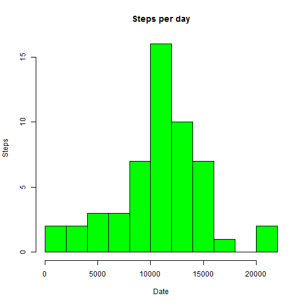
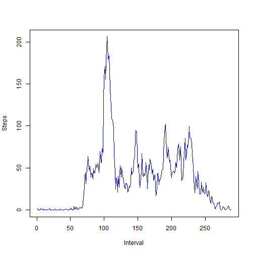
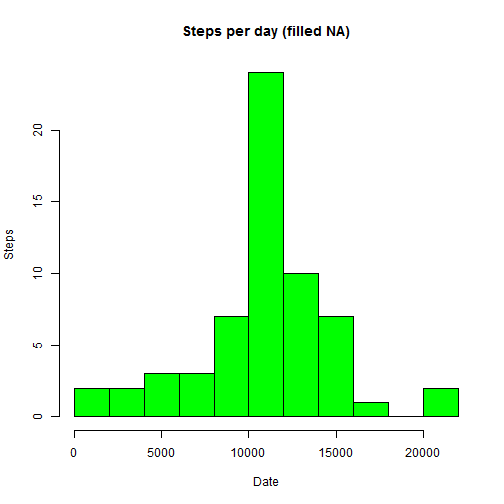
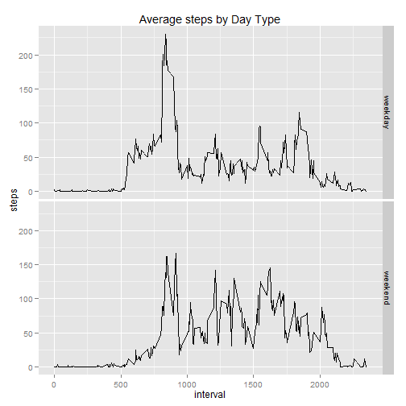

#Reproducible Research / Peer Assignment 1 / December 2014


##1. Loading and preprocessing the data


```r
data <- read.csv("activity.csv", header=TRUE, col.names = c("steps", "date", "interval"), colClasses=c("numeric","character","numeric"))

head(data)
```

```
##   steps       date interval
## 1    NA 2012-10-01        0
## 2    NA 2012-10-01        5
## 3    NA 2012-10-01       10
## 4    NA 2012-10-01       15
## 5    NA 2012-10-01       20
## 6    NA 2012-10-01       25
```

```r
summary(data)
```

```
##      steps            date              interval     
##  Min.   :  0.00   Length:17568       Min.   :   0.0  
##  1st Qu.:  0.00   Class :character   1st Qu.: 588.8  
##  Median :  0.00   Mode  :character   Median :1177.5  
##  Mean   : 37.38                      Mean   :1177.5  
##  3rd Qu.: 12.00                      3rd Qu.:1766.2  
##  Max.   :806.00                      Max.   :2355.0  
##  NA's   :2304
```

```r
str(data)
```

```
## 'data.frame':	17568 obs. of  3 variables:
##  $ steps   : num  NA NA NA NA NA NA NA NA NA NA ...
##  $ date    : chr  "2012-10-01" "2012-10-01" "2012-10-01" "2012-10-01" ...
##  $ interval: num  0 5 10 15 20 25 30 35 40 45 ...
```

```r
date <- as.Date(data$date, "%Y-%m-%d")
interval <- as.factor(data$interval)
```

###2. What is mean total number of steps taken per day?


```r
dailysteps <- aggregate(steps ~ date, data, FUN=sum, na.rm=TRUE)
hist(dailysteps$steps, breaks=10,ylab="Steps", xlab="Date", main="Steps per day", col="green")
```

 

```r
mean(dailysteps$steps)
```

```
## [1] 10766.19
```

```r
median(dailysteps$steps)
```

```
## [1] 10765
```

##3. What is the average daily activity pattern?


```r
dailyinterval <- aggregate(steps ~ interval, data, FUN=mean, na.rm=TRUE)
plot(dailyinterval$steps, type="l", col="blue", ylab="Steps", xlab="Interval")
```

 


###3.1 Maximum number of steps?


```r
dailyinterval$interval[which.max(dailyinterval$steps)]
```

```
## [1] 835
```

##4. Imputing missing values


```r
sum(is.na(data))
```

```
## [1] 2304
```

```r
datawithfilledNA <- merge(data, dailyinterval, by="interval", suffixes = c("",".new"))
filledNA <- is.na(datawithfilledNA$steps)
datawithfilledNA$steps[filledNA] <- datawithfilledNA$steps.new[filledNA]
datawithfilledNA <- datawithfilledNA[, c("steps", "date", "interval")]

head(datawithfilledNA)
```

```
##      steps       date interval
## 1 1.716981 2012-10-01        0
## 2 0.000000 2012-11-23        0
## 3 0.000000 2012-10-28        0
## 4 0.000000 2012-11-06        0
## 5 0.000000 2012-11-24        0
## 6 0.000000 2012-11-15        0
```

```r
sum(is.na(datawithfilledNA))
```

```
## [1] 0
```

```r
dailysteps <- aggregate(steps ~ date, datawithfilledNA, FUN=sum)
hist(dailysteps$steps, breaks=10,ylab="Steps", xlab="Date", main="Steps per day (filled NA)", col="green")
```

 

```r
mean(as.integer(dailysteps$steps))
```

```
## [1] 10766.16
```

```r
median(as.integer(dailysteps$steps))
```

```
## [1] 10766
```
The impact of the missing data is minimal. The mean remained the same and the histogram looks similar to the one without the missing data.The median changed and became a bit greater than the old one.

##5. Are there differences in activity patterns between weekdays and weekends?


```r
newDt <- datawithfilledNA

library(lubridate)
library(caret)
newDt$daytype <- as.factor(ifelse(wday(newDt$date, label=TRUE) %in% c("Sat", "Sun"), "weekend", "weekday"))

averageStepsByDaytype <- aggregate(steps ~ daytype + interval, data = newDt, mean)
ggplot(averageStepsByDaytype) + aes(x=interval, y=steps) + facet_grid(daytype ~ .) + geom_line() + labs(title="Average steps by Day Type")
```

 


Yes there are differences.
Weekday: higher steps during the early intervals + higher peaks
Weekend:higher steps during the middle intervals + balanced activity


